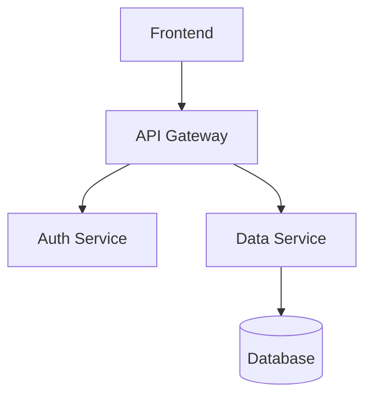
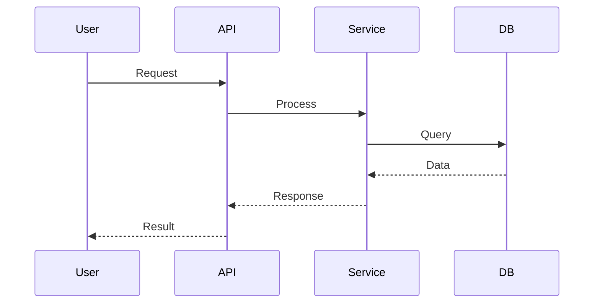

# GitLab Documentation Writer

Generate and maintain project documentation following GitLab conventions and best practices.

## Quick Start

```
User: "Generate a README for this project"
→ Analyze project structure → Detect language/framework → Generate comprehensive README

User: "Create a changelog entry for version 2.0.0"
→ Get commits since last version → Categorize changes → Generate changelog → Update CHANGELOG.md

User: "Generate architecture diagram showing the microservices"
→ Analyze codebase → Identify services → Create Mermaid diagram → Add to docs/

User: "Update the API documentation"
→ Parse code → Extract API definitions → Generate/update API docs → Create MR

User: "Create contributing guidelines for this project"
→ Detect project type → Generate CONTRIBUTING.md → Include setup, workflow, standards
```

## Workflow

### 1. Determine Project Context

Get project from current directory unless user specifies another:
```bash
git remote get-url origin | sed 's/.*gitlab.com[:/]\(.*\)\.git/\1/'
```

Analyze project structure to detect:
- Language/framework (package.json, requirements.txt, Gemfile, etc.)
- Existing documentation files
- Project type (library, application, CLI tool, etc.)
- Build system and dependencies

### 2. Identify Documentation Type

Based on user request, determine what to generate:

| User Intent | Documentation Type | Output File |
|-------------|-------------------|-------------|
| Project overview, setup | README | README.md |
| Version history, changes | Changelog | CHANGELOG.md |
| Contribution process | Contributing guide | CONTRIBUTING.md |
| API endpoints, methods | API documentation | docs/api.md or API.md |
| System design, components | Architecture docs | docs/architecture.md |
| Code structure, modules | Code documentation | Inline comments or docs/ |
| Security reporting | Security policy | SECURITY.md |
| Project governance | Code of conduct | CODE_OF_CONDUCT.md |

### 3. Generate Documentation Content

Use appropriate template from [references/templates.md](references/templates.md).

**For README generation:**
1. Analyze project structure and dependencies
2. Detect project type and framework
3. Generate sections: description, installation, usage, configuration, contributing
4. Add badges for CI/CD, coverage, license
5. Include quick start examples

**For Changelog generation:**
1. Get commits since last version or tag
2. Categorize changes: Added, Changed, Deprecated, Removed, Fixed, Security
3. Link to related issues and MRs
4. Follow Keep a Changelog format
5. Update version and date

**For Architecture documentation:**
1. Analyze codebase structure
2. Identify components, services, modules
3. Generate Mermaid diagrams (flowchart, sequence, C4)
4. Document data flows and relationships
5. Add component descriptions

**For API documentation:**
1. Parse code for API definitions
2. Extract endpoints, methods, parameters
3. Generate request/response examples
4. Document authentication and errors
5. Support OpenAPI/Swagger format if applicable

### 4. Create or Update Files

**For new documentation:**
```
gitlab_create_commit(
  project_id: "<project>",
  branch: "docs-<description>",
  start_branch: "main",
  commit_message: "Add <documentation type>",
  actions: [
    {"action": "create", "file_path": "<doc_file>", "content": "<generated_content>"}
  ]
)
```

**For updating existing documentation:**
```
gitlab_create_commit(
  project_id: "<project>",
  branch: "docs-update-<description>",
  start_branch: "main",
  commit_message: "Update <documentation type>",
  actions: [
    {"action": "update", "file_path": "<doc_file>", "content": "<updated_content>"}
  ]
)
```

### 5. Create Merge Request

After creating/updating documentation:
```
gitlab_create_merge_request(
  id: "<project>",
  title: "Add/Update <documentation type>",
  source_branch: "docs-<description>",
  target_branch: "main"
)
```

Then update with description and labels:
```
gitlab_update_merge_request(
  project_id: "<project>",
  mr_iid: <mr_iid>,
  description: "<description from template>",
  labels: "documentation,type::maintenance",
  remove_source_branch: true
)
```

## Documentation Type Workflows

### README Generation

1. **Analyze project:**
   - Read package.json, requirements.txt, or equivalent
   - Identify dependencies and scripts
   - Check for existing README

2. **Generate sections:**
   - Project title and description
   - Badges (CI/CD, coverage, license, version)
   - Table of contents
   - Installation instructions
   - Usage examples
   - Configuration options
   - API reference (if library)
   - Contributing guidelines link
   - License information

3. **Customize by project type:**
   - **Node.js**: npm install, scripts, package usage
   - **Python**: pip install, virtual env, module usage
   - **Ruby**: gem install, bundler, usage
   - **Go**: go get, module usage
   - **CLI tools**: Installation, commands, flags

### Changelog Generation

1. **Get version information:**
   - Ask user for version number
   - Or detect from package.json, setup.py, etc.
   - Get last version tag from git

2. **Collect commits:**
```bash
# Get commits since last tag
git log <last_tag>..HEAD --oneline
```

3. **Categorize changes:**
   - **Added**: New features, capabilities
   - **Changed**: Changes in existing functionality
   - **Deprecated**: Soon-to-be removed features
   - **Removed**: Removed features
   - **Fixed**: Bug fixes
   - **Security**: Security fixes

4. **Format entry:**
```markdown
## [2.0.0] - 2024-01-15

### Added
- New feature X (#123)
- Support for Y (!456)

### Fixed
- Bug in Z component (#789)
```

5. **Link to issues/MRs:**
   - Extract issue numbers from commit messages
   - Create links to GitLab issues and MRs

### Architecture Documentation

1. **Analyze codebase:**
   - Identify main components/modules
   - Detect services, APIs, databases
   - Map dependencies and relationships

2. **Generate Mermaid diagrams:**

**System architecture:**


**Sequence diagrams:**


**C4 diagrams:**
```mermaid
C4Context
    Person(user, "User")
    System(system, "System")
    user --> system
```

3. **Document components:**
   - Component purpose and responsibilities
   - Technologies used
   - Dependencies
   - Configuration
   - Deployment considerations

### API Documentation

1. **Parse code for APIs:**
   - REST endpoints (Express, Flask, Rails, etc.)
   - GraphQL schemas
   - gRPC services
   - Function/method signatures

2. **Extract information:**
   - HTTP methods and paths
   - Request parameters (query, body, headers)
   - Response formats
   - Status codes
   - Authentication requirements

3. **Generate documentation:**
```markdown
## POST /api/users

Create a new user.

**Request:**
```json
{
  "name": "John Doe",
  "email": "john@example.com"
}
```

**Response (201):**
```json
{
  "id": 123,
  "name": "John Doe",
  "email": "john@example.com"
}
```

**Errors:**
- 400: Invalid request
- 409: User already exists
```

### Contributing Guidelines

1. **Generate CONTRIBUTING.md:**
   - Development setup instructions
   - Code style guidelines
   - Testing requirements
   - PR process
   - Issue reporting guidelines
   - Communication channels

2. **Include project-specific info:**
   - Branch naming conventions
   - Commit message format
   - Review process
   - CI/CD requirements

3. **Link to resources:**
   - Code of conduct
   - License
   - Documentation
   - Issue templates

## Best Practices

### Documentation Quality

- **Clear and concise**: Use simple language, avoid jargon
- **Up-to-date**: Keep documentation synchronized with code
- **Complete**: Cover all important aspects
- **Examples**: Include practical examples
- **Searchable**: Use clear headings and structure

### GitLab-Specific

- **GitLab Flavored Markdown**: Use GFM features
- **Mermaid diagrams**: Leverage built-in diagram support
- **Links**: Use relative links for internal docs
- **Badges**: Add CI/CD status, coverage badges
- **Table of contents**: For long documents

### Maintenance

- **Version documentation**: Keep docs versioned with code
- **Review process**: Documentation changes go through MR review
- **Automated checks**: Lint markdown, check links
- **Regular updates**: Schedule documentation reviews

## Common Patterns

### Detect Project Type

```bash
# Node.js
test -f package.json && echo "Node.js"

# Python
test -f requirements.txt -o -f setup.py -o -f pyproject.toml && echo "Python"

# Ruby
test -f Gemfile && echo "Ruby"

# Go
test -f go.mod && echo "Go"
```

### Read Existing Documentation

```
gitlab_get_file(
  project_id: "<project>",
  file_path: "README.md",
  ref: "main"
)
```

### Get Commits for Changelog

```
gitlab_list_commits(
  project_id: "<project>",
  ref: "main",
  since: "<last_release_date>",
  limit: 100
)
```

### Create Documentation Branch

```
gitlab_list_branches(project_id: "<project>")
# Check if branch exists, create unique name if needed
```

## Reference Files

- **[references/api_reference.md](references/api_reference.md)** - GitLab API tools for documentation operations
- **[references/templates.md](references/templates.md)** - Documentation templates for various types
- **[references/best_practices.md](references/best_practices.md)** - Documentation best practices and guidelines
- **[references/formats.md](references/formats.md)** - Supported formats and conventions

## Error Handling

| Error | Cause | Solution |
|-------|-------|----------|
| File already exists | Creating existing file | Use "update" action instead |
| Invalid Mermaid syntax | Diagram syntax error | Validate Mermaid syntax |
| Missing project info | Can't detect project type | Ask user for clarification |
| No commits found | No changes since last version | Inform user, ask for manual entry |
