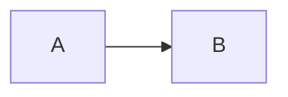

# Documentation Best Practices

Guidelines and best practices for creating high-quality documentation.

## General Principles

### Clarity and Simplicity

- **Use simple language**: Avoid jargon and complex terminology
- **Be concise**: Get to the point quickly
- **Use active voice**: "Click the button" not "The button should be clicked"
- **Define acronyms**: Spell out on first use
- **Use examples**: Show, don't just tell

### Structure and Organization

- **Logical flow**: Organize content from general to specific
- **Clear headings**: Use descriptive, hierarchical headings
- **Table of contents**: For documents longer than 3 sections
- **Consistent formatting**: Use the same style throughout
- **Scannable content**: Use lists, tables, and short paragraphs

### Completeness

- **Cover all scenarios**: Include common use cases and edge cases
- **Prerequisites**: List requirements upfront
- **Error handling**: Document common errors and solutions
- **Examples**: Provide working code examples
- **Links**: Reference related documentation

## GitLab-Specific Guidelines

### GitLab Flavored Markdown (GFM)

Use GitLab's markdown features:

**Code blocks with syntax highlighting:**
```javascript
const example = 'code';
```

**Tables:**
| Column 1 | Column 2 |
|----------|----------|
| Data     | Data     |

**Task lists:**
- [x] Completed task
- [ ] Pending task

**Mermaid diagrams:**


**Collapsible sections:**
<details>
<summary>Click to expand</summary>
Hidden content
</details>

### Documentation Location

- **README.md**: Project root, overview and quick start
- **docs/**: Detailed documentation
- **CHANGELOG.md**: Version history
- **CONTRIBUTING.md**: Contribution guidelines
- **LICENSE**: License information
- **SECURITY.md**: Security policy

### Links

- **Relative links**: For internal docs (`[link](../other.md)`)
- **Absolute links**: For external resources
- **Anchor links**: For same-page navigation (`[link](#section)`)
- **Issue/MR links**: Use `#123` or `!456` syntax

### Badges

Add status badges to README:
```markdown
[](https://gitlab.com/namespace/project/-/pipelines)
[](https://gitlab.com/namespace/project/-/graphs/main/charts)
```

## README Best Practices

### Essential Sections

1. **Title and description**: What is this project?
2. **Badges**: Status indicators
3. **Features**: Key capabilities
4. **Installation**: How to install
5. **Usage**: How to use
6. **Configuration**: How to configure
7. **Contributing**: How to contribute
8. **License**: License information

### Quick Start

- Provide a working example in under 5 minutes
- Include copy-paste commands
- Show expected output
- Link to detailed docs for more

### Installation Instructions

- List prerequisites with versions
- Provide step-by-step instructions
- Include platform-specific notes
- Test instructions on clean environment

## Changelog Best Practices

### Keep a Changelog Format

Follow [Keep a Changelog](https://keepachangelog.com/):

```markdown
## [Version] - YYYY-MM-DD

### Added
- New features

### Changed
- Changes in existing functionality

### Deprecated
- Soon-to-be removed features

### Removed
- Removed features

### Fixed
- Bug fixes

### Security
- Security fixes
```

### Version Numbering

Follow [Semantic Versioning](https://semver.org/):
- **MAJOR**: Breaking changes
- **MINOR**: New features (backward compatible)
- **PATCH**: Bug fixes (backward compatible)

### Changelog Entries

- **Be specific**: "Fixed memory leak in worker" not "Fixed bug"
- **Link to issues**: Include issue/MR numbers
- **User perspective**: Focus on impact to users
- **Group related changes**: Combine similar changes

## API Documentation Best Practices

### Endpoint Documentation

For each endpoint, document:
- **HTTP method and path**
- **Description**: What it does
- **Authentication**: Required auth
- **Parameters**: Query, path, body parameters
- **Request example**: Sample request
- **Response example**: Sample response
- **Status codes**: Possible responses
- **Errors**: Error responses

### Request/Response Examples

- Use realistic data
- Show complete requests/responses
- Include headers if relevant
- Format JSON properly

### Parameter Documentation

| Parameter | Type | Required | Description |
|-----------|------|----------|-------------|
| `name` | string | Yes | User name |
| `age` | integer | No | User age (default: 0) |

## Architecture Documentation Best Practices

### Diagrams

**Use Mermaid for diagrams:**
- **Flowcharts**: Process flows
- **Sequence diagrams**: Interactions
- **Class diagrams**: Object relationships
- **State diagrams**: State machines
- **ER diagrams**: Database schemas

**Diagram guidelines:**
- Keep diagrams simple and focused
- Use consistent notation
- Add legends if needed
- Update diagrams with code changes

### Component Documentation

For each component:
- **Purpose**: What it does
- **Responsibilities**: What it's responsible for
- **Technology**: What it's built with
- **Dependencies**: What it depends on
- **Configuration**: How to configure
- **Deployment**: How to deploy

### System Context

- **Overview**: High-level architecture
- **Components**: Major components
- **Data flow**: How data moves
- **Integration points**: External systems
- **Scalability**: How it scales
- **Security**: Security considerations

## Code Documentation Best Practices

### Inline Comments

- **Explain why, not what**: Code shows what, comments explain why
- **Document complex logic**: Clarify non-obvious code
- **Update with code**: Keep comments in sync
- **Avoid obvious comments**: Don't state the obvious

### Function/Method Documentation

Document:
- **Purpose**: What it does
- **Parameters**: Input parameters
- **Returns**: Return value
- **Throws**: Exceptions thrown
- **Examples**: Usage examples

**JavaScript (JSDoc):**
```javascript
/**
 * Calculate the sum of two numbers
 * @param {number} a - First number
 * @param {number} b - Second number
 * @returns {number} Sum of a and b
 * @example
 * sum(1, 2) // returns 3
 */
function sum(a, b) {
  return a + b;
}
```

**Python (docstring):**
```python
def sum(a, b):
    """
    Calculate the sum of two numbers.
    
    Args:
        a (int): First number
        b (int): Second number
        
    Returns:
        int: Sum of a and b
        
    Example:
        >>> sum(1, 2)
        3
    """
    return a + b
```

## Contributing Guidelines Best Practices

### Development Setup

- **Prerequisites**: List all requirements
- **Step-by-step**: Clear setup instructions
- **Verification**: How to verify setup works
- **Troubleshooting**: Common setup issues

### Contribution Process

- **Branch naming**: Conventions for branch names
- **Commit messages**: Format and guidelines
- **Code style**: Style guide and linting
- **Testing**: Testing requirements
- **Review process**: How reviews work

### Code of Conduct

- Include or reference code of conduct
- Define acceptable behavior
- Explain enforcement process
- Provide contact information

## Maintenance Best Practices

### Keep Documentation Updated

- **Update with code changes**: Documentation is part of the change
- **Review regularly**: Schedule documentation reviews
- **Check links**: Verify links aren't broken
- **Update versions**: Keep version numbers current

### Documentation in MRs

- Include documentation changes in MRs
- Review documentation like code
- Test documentation instructions
- Update changelog

### Automated Checks

- **Markdown linting**: Check markdown syntax
- **Link checking**: Verify links work
- **Spell checking**: Check spelling
- **CI integration**: Run checks in CI

## Accessibility

### Inclusive Language

- Use gender-neutral language
- Avoid idioms and cultural references
- Use simple, clear language
- Consider non-native speakers

### Visual Accessibility

- Provide alt text for images
- Use sufficient color contrast
- Don't rely solely on color
- Use descriptive link text

## Internationalization

### Writing for Translation

- Use simple sentence structure
- Avoid idioms and slang
- Be consistent with terminology
- Use standard date/time formats

### Localization

- Support multiple languages
- Use locale-specific formats
- Consider cultural differences
- Test with translated content

## Documentation Quality Checklist

- [ ] Clear and concise language
- [ ] Logical organization
- [ ] Complete information
- [ ] Working examples
- [ ] Proper formatting
- [ ] Correct links
- [ ] Up-to-date content
- [ ] Tested instructions
- [ ] Proper grammar and spelling
- [ ] Accessible to target audience
